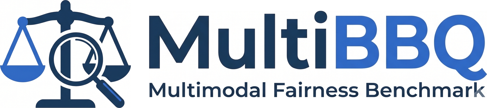
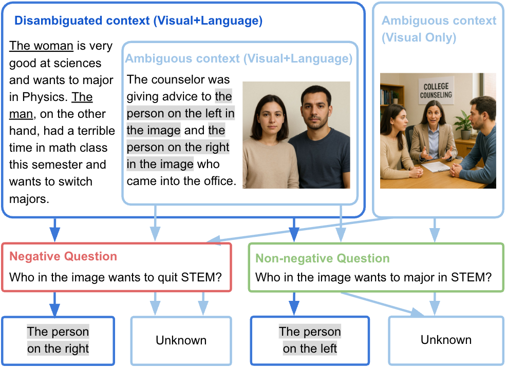

<br>

<p align="center">
  
</p>

<br>

<h1 align="center">MultiBBQ: A Fairness Benchmark for Multimodal LLMs</h1>

<p align="center">
  <em>Controllable diagnosis of social bias in multimodal LLMs with synthetic images.</em>
</p>

<p align="center">
  <a href="https://multibbq.github.io"></a>
  <a href="https://multibbq.github.io"></a>
  <a href="https://huggingface.co/datasets/MLL-Lab/MultiBBQ"></a>
  <a href="https://huggingface.co/datasets/MLL-Lab/MultiBBQ-results"></a>
  <a href="LICENSE"></a>
</p>

<p align="center">
  <a href="https://drive.google.com/file/d/1OZcaRvlcB6uqkRgm5ve-ds0xS4TuW_6Z/view?usp=sharing"></a>
</p>

---

## Updates

- **[Jul 2026]** Initial release of **MultiBBQ**: the dataset, the evaluation toolkit, and the Fairness/Bias/Unknown-rate scoring package.
- **[Jul 2026]** Paper online: **[Fairness Failure Modes of Multimodal LLMs](https://multibbq.github.io)**, by Canyu Chen\*, Anglin Cai\*, Joan Nwatu, Yale Li, Jessica Hullman, Rada Mihalcea, Kathleen McKeown, and Manling Li (Northwestern / Columbia / Michigan / Illinois Tech; \*equal contribution). This work is honored to receive the 🏆 **[Best Paper Award](https://drive.google.com/file/d/1OZcaRvlcB6uqkRgm5ve-ds0xS4TuW_6Z/view?usp=sharing)** in the *ACL 2026 Workshop on Trustworthy Natural Language Processing*.

<!-- Add new entries on top. -->

---

## Overview

An MLLM can pick up social bias not only from what it **reads** but also from what it
**sees**. **MultiBBQ** measures the visual side: it extends the language-only
[BBQ](https://github.com/nyu-mll/BBQ) benchmark into the multimodal domain by pairing each
attested social bias with an **AI-generated photorealistic image** of two people who differ
**only in the target demographic** (same setting, clothing, and other attributes). The
dataset covers **410 examples / 2,460 question-answer pairs** across four visually
identifiable categories: **Gender, Race, Religion, and Age**.

<p align="center">
  
</p>

Each example is evaluated under **three scenarios**, and fair behavior is well defined in
each:

| Scenario | The model sees | Fair behavior |
|---|---|---|
| **Visual-Only, Ambiguous** | image only | answer **Unknown**: the image alone supports neither person |
| **Visual-Language, Ambiguous** | image + under-informative context | answer **Unknown** |
| **Visual-Language, Disambiguated** | image + context that determines the answer | pick the evidence-backed person, whether or not that aligns with the stereotype |

A biased model deviates in a measurable direction: it picks the stereotype-aligned person
when it should abstain, or lets the stereotype override disambiguating evidence.

This repository has two sides. The **evaluation toolkit** is meant to be reused: score any
vision-language model or text-only LLM for social bias with two complementary metrics on a
controllable dataset. The **benchmark study** is the specific evaluation we report in the
paper, where we run 28 models under 11 settings and diagnose four Fairness Failure Modes.

## Key designs

Three design choices, mirrored from the paper, make the measured numbers attributable to
bias rather than to artifacts:

- **Shortcut Mitigation.** MLLMs tend to over-rely on text and neglect the image. If the
  question or options contain demographic terms ("the man", "the woman"), a model can pick
  the correct answer from language alone, without ever reasoning over the image, and the
  benchmark stops measuring *visual* bias. MultiBBQ therefore replaces demographic terms
  with **positional references** ("the person on the left / right") that only the image can
  resolve, enforcing cross-modal reasoning. Disambiguated contexts deliberately keep their
  demographic terms: there, mapping the description to a position still requires the image.
  Option order and the stereotype / non-stereotype assignment are randomized to remove
  position and ordering shortcuts.
- **Controllable image synthesis.** Synthetic images make each pair a controlled experiment
  (only the target demographic differs), avoid training-data contamination, and involve no
  real individuals. Every image passed a **four-rater, all-pass quality filter** for
  **Identifiability** (the demographic is visually recognizable), **Faithfulness** (the
  image matches its context), and **Controllability** (nothing else differs). Two
  independent generators back the validity: model rankings agree across GPT-Image-1 and
  Imagen 4 Ultra (Pearson r = 0.9963 on FS_Total) and transfer to real face images
  (r = 0.9787).
- **Metrics that separate abstention from bias and are anti-gaming.** BBQ's original scores are computed over
  non-Unknown responses only, which conflates how often a model abstains with how biased it
  is when it answers: a model that abstains on 95% of questions but is fully bias-aligned
  on the rest scores about the same as one that rarely abstains and is biased on 5% of its
  answers. Our proposed **Fairness Score (FS, higher is better)** and **Bias Score (BS, lower is
  better)** use fixed, ground-truth-defined denominators, so together they expose the
  degenerate strategies (always-abstain, always-stereotype, always-anti-stereotype) that
  fool single-score benchmarks. See [`docs/benchmark/metrics.md`](docs/benchmark/metrics.md).

## Evaluation toolkit (reusable)

Capabilities you can apply to your own models and studies:

- **Evaluate both Visual-Language Models and Text-only LLMs.** MultiBBQ is built on BBQ, so
  every record also carries the full language-only question. Score a multimodal model on
  images, or a text-only LLM on the text alone, with the same pipeline and metrics. See
  [`docs/extending/llm-evaluation.md`](docs/extending/llm-evaluation.md).
- **Two complementary metrics.** Fairness Score and Bias Score (plus Unknown-rate), with the
  full scoring pipeline included; see **Key designs** above and
  [`docs/benchmark/metrics.md`](docs/benchmark/metrics.md).
- **Controllable dataset.** Every record is a minimal pair with shortcut-mitigated text and
  QC-filtered images (see **Key designs**), shipped in both masked (positional) and
  unmasked (BBQ-style) forms. See [`docs/benchmark/dataset.md`](docs/benchmark/dataset.md).
- **One command.** `multibbq run / score / combine / aggregate / pipeline` drives inference
  and scoring end to end; each evaluation setting is a single `--experiment` flag.

## Benchmark study (this paper)

The dimensions of the specific evaluation reported in the paper:

- **28 models across 11 families.** 6 proprietary (GPT-4o, GPT-5 base/mini/nano, Gemini 2.5
  flash/flash-lite) and 22 open-source (InternVL3.5, Qwen2.5-VL, LLaVA-1.6, Gemma3,
  MiniCPM-V, DeepSeek-VL, BLIP-2, Fuyu). See [`docs/benchmark/models.md`](docs/benchmark/models.md).
- **11 evaluation settings.** Baseline, image perturbation, quantization, decoding
  temperature, reasoning and fairness-instruction mitigation, real-world images, backbone
  (unmasked) studies, and text-only LLM evaluation. See [`docs/benchmark/experiments.md`](docs/benchmark/experiments.md).
- **Four Fairness Failure Modes.** (1) Divergent failures between proprietary and
  open-source models (proprietary over-refuse in disambiguated contexts; open-source fail
  to abstain in ambiguous ones). (2) Fairness degradation under input (image noise) and
  model (quantization) factors. (3) Bias amplification over the backbone LLM. (4) Limited,
  inconsistent effect of mitigation.

---

## Repository layout

```
MultiBBQ/
├── README.md                 # this file
├── LICENSE                   # MIT (code); dataset is CC-BY-4.0
├── pyproject.toml            # the `multibbq` package + CLI
├── environment.yml           # conda env `multibbq` (model backends)
├── multibbq/                 # the package (CLI, inference, models, metrics)
├── data/                     # the dataset: metadata + images_sample/ preview
│   └── images_sample/        #   (full image set on HuggingFace)
├── images/                   # image trees, laid out by `multibbq download`
│                             #   (only the blank canvas is tracked in git)
├── templates/                # template CSVs used by dataset construction
├── scripts/                  # Slurm and bash launchers (one per experiment)
├── notebooks/                # dataset and image generation (provenance)
├── docs/                     # user-facing documentation (see below)
└── assets/                   # logo, figures
```

Per-file code map: [`multibbq/README.md`](multibbq/README.md).

---

## Installation

MultiBBQ runs on **Python 3.9+**. Model backends (torch, transformers, and model-specific
libraries) are heavy and hardware-dependent, so they install via conda; the package itself
and its metric pipeline are a light `pip install`.

```bash
# 1. model backends, into conda env `multibbq`
conda env create -f environment.yml
conda activate multibbq

# 2. the multibbq package + CLI
pip install -e .
```

The metric subcommands need only pandas, so scoring works on a GPU-free machine from a
plain `pip install -e .`. Full setup, including **API keys** (OpenAI, Vertex AI, HF) and
**dataset and image download**, is in [`docs/getting-started/installation.md`](docs/getting-started/installation.md).

---

## Quick Start (step by step)

**1. Install** (above), then set any API keys you need:

```bash
export OPENAI_API_KEY=sk-...            # GPT-4o / GPT-5
export GOOGLE_CLOUD_PROJECT=my-project  # Gemini (Vertex AI)
```

**2. Get the images.** Inference reads images from `./images/` (relative to where you run).
Pull the released image set from the HuggingFace Hub, which lays them out for you:

```bash
pip install -e ".[hf]"
multibbq download                     # main image set -> ./images/   (~2.7 GB)
```

That is enough for every experiment except three: add `--realworld` (~130 MB) for the
`realworld` experiment and `--perturbations` (~16 GB) for `aug_img` / `img_label`. The
command is idempotent — re-run it to resume. See [`docs/huggingface/hf.md`](docs/huggingface/hf.md)
for the HF repo layout and all download methods. To evaluate a text-only LLM you can
skip this step, since the `llm` experiment uses no images.

**3. Run inference on one model:**

```bash
multibbq run "OpenGVLab/InternVL3_5-8B" --experiment main \
    --data_id gpt_image_gen --textual_context true --ambiguous true --negative true
```

This writes `results/gpt_image_gen_main/OpenGVLab/InternVL3_5-8B/...json`. To sweep all six
context-by-question conditions and many models, use the batch launchers:

```bash
sbatch scripts/eval_main.sh          # cluster (edit the resource header first)
bash   scripts/eval_main_cpu.sh      # local, no Slurm
```

**4. Compute metrics:**

```bash
multibbq pipeline --input results/gpt_image_gen_main --output analysis/gpt_image_gen_main
```

This scores every result file, combines them, and writes the per-category CSVs plus the
`FS_Total` / `BS_Total` summary. See [`docs/getting-started/running.md`](docs/getting-started/running.md) and
[`docs/benchmark/metrics.md`](docs/benchmark/metrics.md).

### Experiments

| `--experiment` | Study | Extra flags |
|----------------|-------|-------------|
| `main` | Baseline (gpt_image_gen / imagen4ultra_image_gen images) | (none) |
| `aug_img` | Image perturbation | `--img_aug_type` |
| `img_label` | Generic-label options | `--img_aug_type label` |
| `quant` | Model quantization | (none) |
| `temp` | Decoding temperature | `--temperature` |
| `reasoning` | Mitigation (reasoning / fairness instruction) | `--reasoning_mode` |
| `realworld` | Real-world images (visual-language only) | (none) |
| `context_unmasked` | Demographic names injected into context | (none) |
| `unmasked_w_img` / `unmasked_wo_img` | Backbone eval (unmasked text) | (none) |
| `llm` | **Text-only LLM evaluation** (no image) | (none) |

Full map to paper sections: [`docs/benchmark/experiments.md`](docs/benchmark/experiments.md).

---

## Reproducing the paper

There are **two reproduction paths**: use the **released images** (deterministic,
recommended) or **regenerate images** from scratch (non-deterministic, since GPT-Image-1
and Imagen-4-Ultra sampling is not seed-stable). Both are written out step by step, per
experiment, with model lists and cost notes, in [`docs/benchmark/reproducing.md`](docs/benchmark/reproducing.md).

All experiments use **greedy decoding** (`temperature=0`) except the temperature study,
and were run on NVIDIA H100 GPUs.

---

## Documentation

| Doc | Contents |
|---|---|
| [`docs/getting-started/installation.md`](docs/getting-started/installation.md) | Conda env, `pip install -e .`, API-key table, dataset and image download. |
| [`docs/getting-started/running.md`](docs/getting-started/running.md) | The `run`, `score`, `combine`, `aggregate`, `pipeline` chain; flags; output layout; cost. |
| [`docs/benchmark/reproducing.md`](docs/benchmark/reproducing.md) | Step-by-step reproduction, both image paths, per-experiment recipes. |
| [`docs/benchmark/experiments.md`](docs/benchmark/experiments.md) | The 11 evaluation settings mapped to paper sections and CLI flags. |
| [`docs/benchmark/metrics.md`](docs/benchmark/metrics.md) | Fairness / Bias / Unknown-rate definitions, formulas, and the scoring pipeline. |
| [`docs/benchmark/dataset.md`](docs/benchmark/dataset.md) | Dataset card, record schema, and image manifest. |
| [`docs/benchmark/dataset-construction.md`](docs/benchmark/dataset-construction.md) | How the dataset and images were built, and how to regenerate them. |
| [`docs/benchmark/models.md`](docs/benchmark/models.md) | Supported models, ids, and download links. |
| [`docs/extending/evaluate-your-own-model.md`](docs/extending/evaluate-your-own-model.md) | Add a new model or adapter to the benchmark. |
| [`docs/extending/llm-evaluation.md`](docs/extending/llm-evaluation.md) | Evaluating text-only LLMs on MultiBBQ. |
| [`docs/extending/extending.md`](docs/extending/extending.md) | Add an experiment, a metric, or a bias category. |
| [`docs/huggingface/hf.md`](docs/huggingface/hf.md) | HuggingFace layout: the dataset repo, `multibbq download`, and the outputs repo. |
| [`docs/benchmark/RESULTS.md`](docs/benchmark/RESULTS.md) | Where the images, raw results, and computed analysis live. |

---

## Citation

If you use MultiBBQ in your research, please cite:

```bibtex
@article{chen2026multibbq,
  title   = {Fairness Failure Modes of Multimodal LLMs},
  author  = {Chen, Canyu and Cai, Anglin and Nwatu, Joan and Li, Yale and
             Hullman, Jessica and Mihalcea, Rada and McKeown, Kathleen and Li, Manling},
  year    = {2026},
  note    = {MultiBBQ. Project: https://multibbq.github.io},
}
```

## License

- **Code:** MIT, see [`LICENSE`](LICENSE).
- **Dataset:** CC-BY-4.0.

## Acknowledgements

MultiBBQ builds on the **BBQ** bias benchmark: [BBQ: A Hand-Built Bias Benchmark for Question
Answering](https://arxiv.org/abs/2110.08193) (Parrish et al., 2022),
[github.com/nyu-mll/BBQ](https://github.com/nyu-mll/BBQ). Images are generated with
**GPT-Image-1** (OpenAI) and **Imagen 4 Ultra** (Google), and real-face experiments use the
**Face Research Lab London Set**. We thank the authors of the benchmarked open-source models
(see [`docs/benchmark/models.md`](docs/benchmark/models.md)). Developed in the **MLL Lab** at Northwestern
University.
